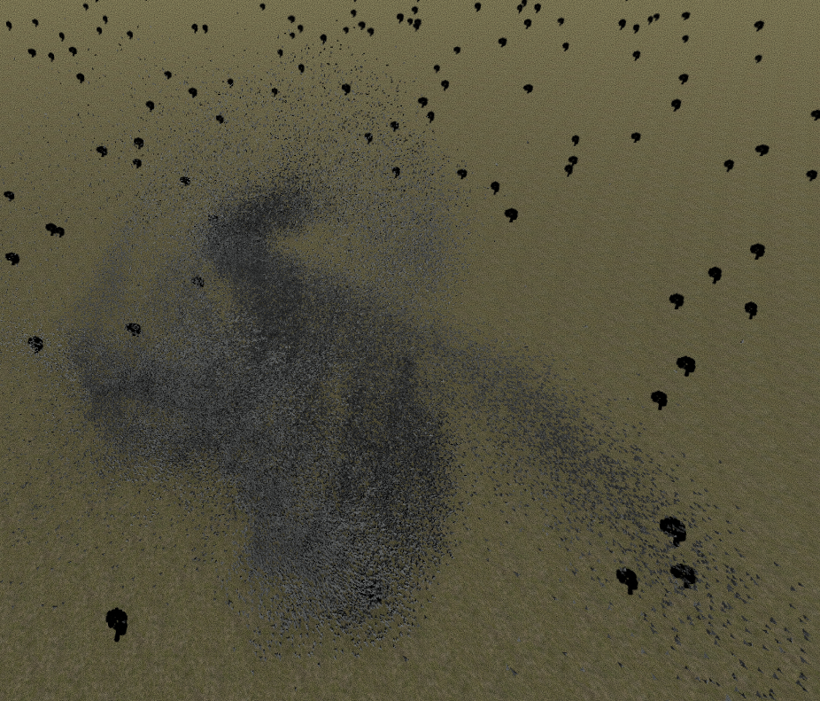

# Unity-2019.1-ECS-Boids-Murmuration
Unity's published Boids example (from here https://github.com/Unity-Technologies/EntityComponentSystemSamples) 
extended to a "murmuration of birds".

You can find a video of the final result here: https://www.youtube.com/watch?v=qMMV25xQ39Q

